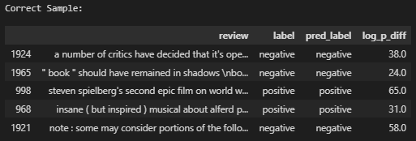

## Analysis of Naïve Bayes Sentiment Polarity Classifier predictions

Overall, the Laplace-smoothed Naïve Bayes model's performance was good in this sentiment analysis task, with an accuracy of 83%. The accuracy of the model improved significantly with the inclusion of Laplace/Add-1 smoothing when calculating conditional probabilities. This is because words which only occurred in a single class, were given very low probabilities of occurring in the other class, rather than just considering the words in each class separately. All the unigram probabilities used in this analysis were calculated in Section 3.2 of my [testing_notebook](../testing_notebook.ipynb). The reviews which I analyse here, are also displayed in full in Section 3.2 of the notebook.

See below the sample of correct and incorrect predictions I analysed, with the log probability difference between the positive and negative class, as calculated by the model. Larger differences suggest the model was more confident in it's decision. The correct predictions from the model were generally more confident than the incorrect ones, which is a desirable property in a generative classifier. 

### Correct predictions

**1. Summer Catch (Negative review):**

To me, this review was unambiguously negative, with several words which often imply negative sentiment, towards the independent movie "Summer Catch". These include the words:  "talentless, generic, disposable"  and "utterly", among others.

I thought that these words probably contributed to the negative prediction. To check this, I compared the probabilities of the words occurring in positive and negative reviews using their respective unigram language models. The result showed that of the four words above, they all contribute to the negative prediction. Most of these words were much more likely to occur in negative reviews than positive. Few words of positive sentiment were used in the review, while many negative words were used which led to the confident prediction. 

**2. Book of Shadows: Blair Witch 2 (negative review):**

This review was more ambiguous than the first, with moments where the movie is praised and others where it is criticised. The first segment of the review praises it's prequel, with positive words such as "brilliant, remarkable, convincing", and "authentic". But then goes on to discuss this movie with negative, often satirical wording.

As with the previous review, I will check the unigram probabilities of the following words, present in the review, that intuitively would occur more in negative reviews than positive ones. Words I thought would contribute to negative prediction include: "stupidly, predictable, poor, ruined, unaccomplished, obnoxious" and "amateurish". Checking unigram probabilities for the first four reveals that they all contributed to the negative prediction. This review was less confident than the first, most likely due to the segment praising the first "Blair Witch" movie.

**3. Saving Private Ryan (positive review):**

This review of "Saving Private Ryan" is almost entirely positive, showered with words of positive sentiment towards the film, including "epic, masterpiece, powerful, greatest, astonishing", and "miracle". These were only in the first paragraph. This was the most confident positive prediction in the sample, with a log probability difference of around 65. There was a small segment of the review criticising a small segment of the movie with words like "horrible", and "ridiculous", but these didn't add enough noise to throw off the prediction. The probabilities below verify that the positive words above contributed to the correct prediction. 

**4.  Cannibal! The Musical (positive review):**

This is an entirely positive review, which goes into detail on some of the musical elements in the movie. Positive comments towards the movie are mostly saved to the final parts of the review, with words such as "beautiful, entertaining, achievement", and "best" which all contributed to the positive prediction. 

**5. The Avengers (negative review):**

This review was ultimately negative, without much room for confusion from the perspective of a Naïve Bayes classifier. Words used to describe the film here include "joyless, lacking, uninvolving, ridiculous, disaster", and "carnage". Although, positively sentimental words such as "excitement, thrills, wit" and "remarkable" are used in a backhanded manner: "lacking any semblance of excitement, thrills, or wit".

### Incorrect predictions

**6. Trees Lounge (positive review):**

This review of the movie "Trees Lounge" is fairly mixed. This was the most unconfident prediction by the model in the sample, with a log probability difference of roughly 0.08.  I would expect that words such as "awfully, slow, pestering, loser, dies", and "expectation" lead to the negative prediction. There are less positively sentimental words used in the review, some of which include "good" and "memorable". This remark by the reviewer, which summarises their opinion, helps to understand this incorrect prediction:

"I liked this movie alot even though it did not reach my expectation". Of the words I checked, they were all more likely to occur in a negative review than a positive except for "slow". Although the difference between the probabilities of "slow" is so small that it would have very little impact on the prediction.

**7. Fear (positive review):**

This review was overall positive, but not overly. And criticises some elements of the movie while praising others ("It isn't the most original premise in the world, but it's handled pretty well here"), with a mix of positive and negatively sentimental language. Positive language includes "good, goodness, coolest, ground breaking, best" and "success". 

Of the first few words, I found that "coolest" was more likely to occur in negative reviews, and good appears at about the same rate in positive and negative reviews. Additionally, words with negative sentiment included "problems, contrived, mindless, nightmare", and "critique", which contributed to this incorrect prediction.

 

**8. D\*\*k (negative review):**

The reviewer proposes changes to the movie that would have resulted a "wonderful satire", and I believe these segments of the review, which show a more positive outlook, contributed to the incorrect  "positive" label prediction. Not many definitively negative words are used in the review, the worst of which include "revisionist" and "poor", so the Naïve unigram approach fails to correctly classify the review as negative. 

Several positive words are used to describe what the movie could have been, such as "remarkable, excellent", and "wonderful", which were all more likely to occur in positive reviews.

**9. Hoodlum (negative review):**

This review frequently compares the movie "Hoodlum" , in the reviewers words, "arguably, the best gangster movie of all time, "The Godfather". The reviewer liked several elements of the movie, using the positively sentimental word "enjoyed" several times. 

Although, words with negative sentiment, such as "insult, distraction", and "similarities" were used when comparing the two movies. Notably, Mario Puzo, director of "The Godfather" is mentioned, whose name has a much higher probability of occurring in positive reviews, contributing to the incorrect prediction.

**10.  Armageddon (positive review):**

This review, although positive, criticises the film the entire time with words like "stupid, shallow, bad, wrong" and "pretentions". There is no positive critiquing of the movie, as the reviewer seems to have enjoyed it for how bad it was. This was the most confident incorrect prediction in the sample, with a log probability difference of about 56. I think this makes sense, since the Naïve Bayes model considers the words used in the review without zoning in on specific opinion-defining parts. 

This one sentence decided the sentiment label of the review: "Armageddon is as stupid, as loud and as shallow as any movie you'll see come out this summer, or maybe even any other summer. But I loved every freaking minute of it."

